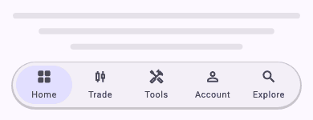
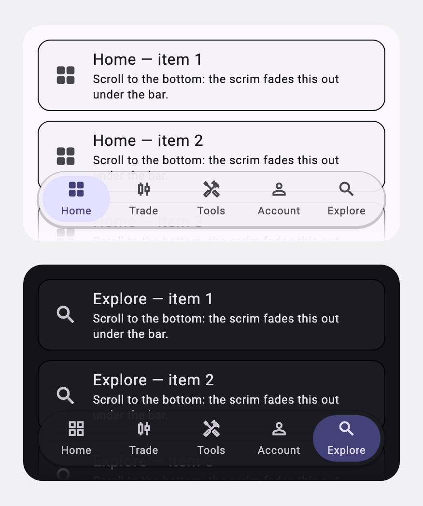
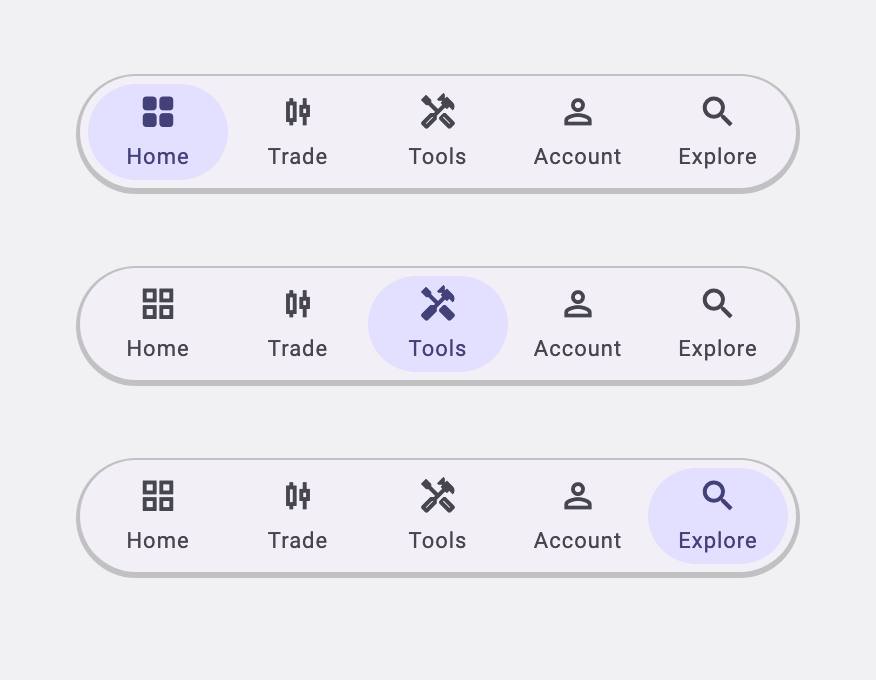

# floating_nav_bar

A bottom navigation bar that **floats over the content** as a rounded capsule,
its selection marked by a **pill that slides** between destinations. Each
destination carries two icons — a line weight and a filled one — and the bar
swaps them as the pill arrives.

Material comes from the **`material_ui`** package rather than from
`package:flutter/material.dart`, so your app has to be on `material_ui` too —
its `ThemeData` and `ColorScheme` are not the framework's. Beyond that the bar
asks nothing of you: no assets, no localisations, no icon pack, no other
pub.dev dependency. Colours, shapes and metrics come from a `ThemeExtension`
you register, and with none registered it derives a palette from the ambient
`ColorScheme`.



The bar over page content, in light and dark, with the scrim fading that content
out underneath it:



And the pill at three selections — the selected destination is drawn in its
filled icon, the rest in their line icon:



## Install

```bash
flutter pub add floating_nav_bar
```

Or add it to `pubspec.yaml` yourself — it is a runtime dependency:

```yaml
dependencies:
  floating_nav_bar: ^1.0.0
  material_ui: ^1.0.0
```

then:

```bash
flutter pub get
```

## Use

The bar is driven by you: it reports the tapped index and you decide what that
means.

```dart
FloatingNavBar(
  destinations: const [
    NavBarDestination(
      label: 'Home',
      lineIcon: Icons.home_outlined,
      fillIcon: Icons.home,
    ),
    NavBarDestination(
      label: 'Search',
      lineIcon: Icons.search_outlined,
      fillIcon: Icons.search,
    ),
    NavBarDestination(
      label: 'Account',
      lineIcon: Icons.person_outline,
      fillIcon: Icons.person,
    ),
  ],
  activeIndex: _index,
  onDestinationSelected: (i) => setState(() => _index = i),
)
```

Icons come from wherever you like — the bar takes plain `IconData`. Material's
outlined and filled variants pair up directly, as does any other family
shipping two weights, which gives the filled-on-select look for free; with only
one weight to hand, leave `fillIcon` off and it is used for both.

The bar is built to **overlap** what it sits above, so put it at the bottom of a
`Stack` over your content rather than in `Scaffold.bottomNavigationBar`:

```dart
Scaffold(
  body: Stack(
    children: [
      content,
      Positioned(
        left: 0,
        right: 0,
        bottom: 0,
        child: FloatingNavBar(...),
      ),
    ],
  ),
)
```

It sizes itself to `destinations.length * itemWidth`, centred in the width it is
given, and shrinks its destinations only when that width cannot hold them.

### With a router

`onDestinationSelected` owns the navigation, so a `StatefulNavigationShell`
drops straight in. The bar highlights the tap before calling you, so it answers
the touch even while the branch switch is in flight, and an out-of-range
`activeIndex` — the `-1` a router reports between branches — leaves the
highlight where it is instead of blinking it off.

```dart
FloatingNavBar(
  destinations: destinations,
  activeIndex: shell.currentIndex,
  // Re-tapping the active destination resets that branch to its root.
  onDestinationSelected: (i) =>
      shell.goBranch(i, initialLocation: i == shell.currentIndex),
)
```

## Theming

Register `FloatingNavBarTheme` as a `ThemeExtension` and every bar in the app
follows your light and dark themes:

```dart
MaterialApp(
  theme: ThemeData(
    extensions: [
      FloatingNavBarTheme(
        barColor: palette.surface.withValues(alpha: 0.8),
        indicatorColor: palette.primaryLight,
        selectedItemColor: palette.primary,
        unselectedItemColor: palette.textMuted,
        labelStyle: typography.captionMedium,
        barShadows: [BoxShadow(color: palette.shadow, blurRadius: 10)],
        scrimColor: palette.surface,
      ),
    ],
  ),
);
```

Anything on the theme can also be set per instance, and the instance wins:

```dart
FloatingNavBar(
  destinations: destinations,
  activeIndex: _index,
  onDestinationSelected: _onSelected,
  indicatorColor: Colors.amber,
  itemWidth: 64,
  showScrim: false,
)
```

The knobs, in short:

| | |
|---|---|
| **Colours** | `barColor`, `indicatorColor`, `selectedItemColor`, `unselectedItemColor`, `scrimColor` |
| **Type** | `labelStyle`, `selectedLabelStyle`, `fontFamily` |
| **Shape** | `barRadius`, `indicatorRadius`, `barShape`, `indicatorShape`, `smoothCorners`, `barShadows` |
| **Metrics** | `height`, `itemWidth`, `iconSize`, `iconLabelSpacing`, `barPadding`, `itemPadding`, `margin`, `scrimHeight` |

### Corners

By default the bar's corners are a **superellipse** — the smoothed, iOS-style
squircle — drawn by the framework's `RoundedSuperellipseBorder` and rasterised
by the engine, so it costs no more than a plain rounded rectangle. Set
`smoothCorners: false` for circular arcs.

For corner geometry the framework does not ship, hand over a whole
`ShapeBorder` and keep that dependency in your own pubspec:

```dart
FloatingNavBarTheme(
  // …
  barShape: SmoothRectangleBorder(
    borderRadius: SmoothBorderRadius(cornerRadius: 32, cornerSmoothing: 1),
  ),
);
```

### The scrim

Because the bar overlaps the content, it fades a gradient up behind itself to
keep scrolling text from running into it. Set `scrimColor` to your page
background to switch it on — usually the same colour as `barColor` at full
opacity — and `scrimHeight` for how far up it reaches. Pass `showScrim: false`
to drop it for one bar.

## Accessibility & RTL

- Every destination is a `Semantics` button carrying its selected state, with a
  `semanticLabel` per destination when the visible label is too terse to read
  aloud.
- Destinations are 48 dp tall at the default `height`, meeting the minimum tap
  target.
- The indicator is positioned with `AlignmentDirectional`, so it starts from the
  right and slides leftwards under `TextDirection.rtl`.

## Example

`example/` is a runnable app: the bar over scrolling content, in light and dark,
LTR and RTL.

```bash
cd example && flutter run
```

The images above are rendered from the real widgets, so they can be regenerated
whenever the bar changes:

```bash
cd example && flutter test --update-goldens test/screenshots_test.dart && flutter test tool/record_nav_gif.dart
```

## Licence

MIT — see [LICENSE](LICENSE).
